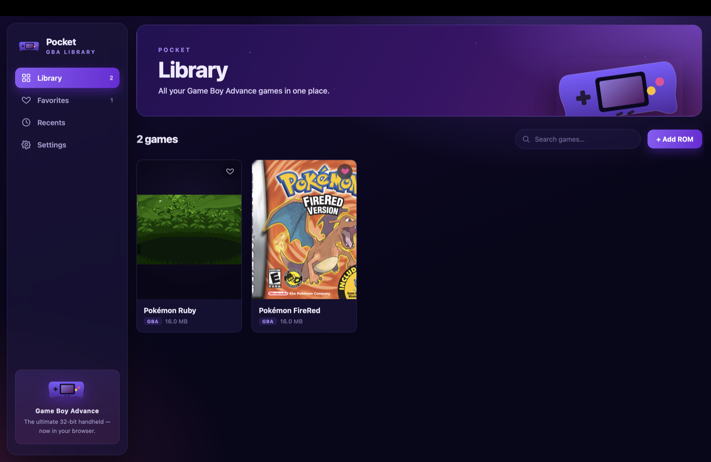
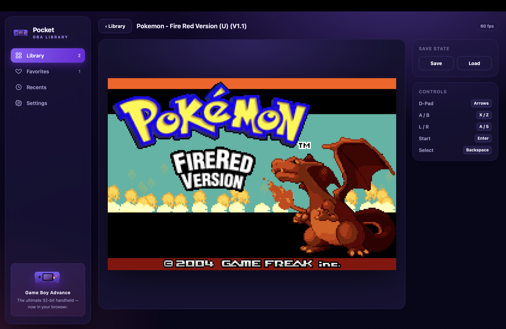
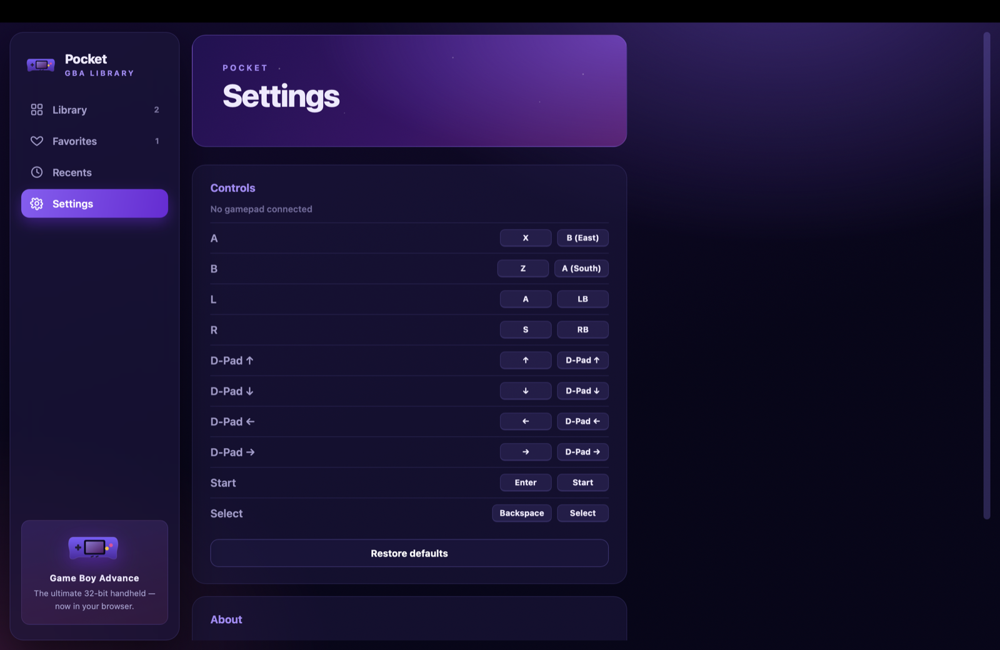

# Pocket

**A modern Game Boy Advance emulator — for your whole retro library, not just a file.**

Pocket plays your Game Boy Advance games with a clean, modern interface: a real
library with cover art, save states, remappable controls, and a native desktop
app for macOS, Windows, and Linux. Under the hood it's a from-scratch ARM7TDMI
emulator written in Rust; on the surface it's an app that actually looks like it
was made this decade.

> The emulation scene is full of accurate cores stuck behind interfaces from
> 2008. Pocket keeps the accuracy and gives it a home worth opening.

## Download

Grab the installer for your platform from the **[Releases page](../../releases)**:

| Platform | File |
|----------|------|
| macOS (Intel + Apple Silicon) | `.dmg` |
| Windows | `.msi` or `.exe` |
| Linux | `.AppImage`, `.deb`, or `.rpm` |

Prefer the browser? Pocket also runs entirely in a web page — no install. See
[Run it yourself](#run-it-yourself).

> **Bring your own ROMs.** Pocket ships no games. Use public-domain homebrew, or
> dumps of cartridges you own. Your games and saves stay on your device —
> nothing is uploaded anywhere.

## Screenshots

| Library | In-game | Controls |
|:---:|:---:|:---:|
|  |  |  |

*(Images live in [`docs/screenshots/`](docs/screenshots/) — see that folder for
what to capture.)*

## What makes it different

Most emulators nail accuracy and stop at a file-open dialog. Pocket treats your
collection like a modern app treats your content:

- **A real library, not a file picker.** Your games live in a grid — searchable,
  favoritable, with recently-played — stored locally, not re-opened from disk
  every time.
- **Automatic cover art & clean names.** Drop in `firered.gba` and it becomes
  *Pokémon FireRed* with its box art. Covers load at runtime from the community
  [libretro thumbnail server](https://thumbnails.libretro.com) (nothing
  copyrighted is bundled), falling back to a real screen capture of the game.
- **Play your way.** Keyboard and gamepad, both fully remappable with a live
  "press to assign" — no config files.
- **No BIOS hunting.** The BIOS is emulated, so games boot from just the ROM.
- **One app, everywhere.** The same emulator in your browser and as a native
  desktop window — your library follows.
- **Genuinely open source.** MIT / Apache-2.0, hackable end to end, from the ARM
  decoder to the CSS.

## Features

- **Runs commercial games** — Pokémon FireRed, Ruby, and homebrew alike.
- **Full graphics & sound** — every background/sprite mode, blending effects, and
  the PSG + Direct Sound audio games use for music.
- **Cartridge saves** — in-game saves (SRAM / Flash) persist per game across
  reloads.
- **Save states** — snapshot and jump back anytime.
- **Library** — cover art, clean titles, inline rename, favorites,
  recently-played, drag-and-drop import, search.
- **Configurable controls** — keyboard + gamepad, remappable and persisted.
- **Native desktop app** — a real window with a **File → Open ROM…** menu.

## The bigger idea

Pocket plays Game Boy Advance today, but that's the starting point, not the
destination. The architecture is deliberately split: a **pure emulator core**
with zero UI knowledge, behind a **system-agnostic library and player**. That
separation is what makes the north-star possible —

> **One beautiful app for your whole retro collection.** Game Boy / Color, NES,
> SNES, Genesis, and beyond — each as an additional core slotting into the same
> library, the same save-state system, the same controls, the same polish.
> Not a different dated emulator per console; one modern home for all of them.

Getting there means growing the shared shell (multi-system library, per-core
settings, a unified save format) while adding cores one at a time. GBA proves the
shape; the rest is repetition with a good foundation.

## Roadmap

**Done**
- ✅ Full GBA emulation — CPU, graphics, sound, DMA/timers/interrupts
- ✅ Cartridge saves + save states
- ✅ Modern web frontend — library, cover art, redesigned UI
- ✅ Configurable keyboard + gamepad controls
- ✅ Native desktop app (Tauri) with cross-platform release builds

**Next**
- 🔜 Richer gamepad support — per-model tuning (PS5 DualSense, Xbox, Switch Pro)
- 🔜 Hardening — Content-Security-Policy, code signing / notarization (see
  [Notes on installers](#notes-on-installers))
- 🔜 EEPROM saves; cartridge prefetch & cycle-accurate timing polish

**Exploring**
- 💡 **Multi-system support** — additional cores (GB/GBC, NES, SNES…) under the
  same shell
- 💡 Cloud-syncable saves, cartridge fast-forward, shaders / display filters
- 💡 A unified save-state format shared across cores

**Pocket is under active development** — continuous improvements to accuracy,
performance, and the interface. Issues and pull requests are welcome.

## Run it yourself

**In the browser:**

```sh
npm install
npm run wasm     # build the Rust core → WebAssembly (needs wasm-pack)
npm run dev      # open the printed localhost URL
```

**As a desktop app:**

```sh
npm run tauri dev      # native window with hot reload
npm run tauri build    # build an installer for your current OS
```

Then drag a `.gba` onto the window, use **Add ROM**, or (desktop)
**File → Open ROM…**.

**Default controls** — D-Pad: arrows · A/B: X/Z · L/R: A/S · Start/Select:
Enter/Backspace. All remappable in **Settings → Controls**.

## Notes on installers

The release installers are **not code-signed yet**, so your OS will warn you the
first time you open the app. It's safe — signing just costs money we haven't set
up:

- **macOS:** right-click the app → **Open** → **Open** (or *System Settings →
  Privacy & Security → Open Anyway*).
- **Windows:** on the SmartScreen prompt, click **More info → Run anyway**.

For the same reason the desktop webview currently ships without a strict
Content-Security-Policy. Both signing and CSP hardening are on the roadmap.

## Under the hood

| Layer | Tech |
|-------|------|
| Emulator core | **Rust** (`core/`) — pure, no UI, ~120 tests |
| Core → web | **WebAssembly** (`wasm-bindgen` / `wasm-pack`) |
| Interface | **React + TypeScript**, built with **Vite** |
| Desktop | **Tauri v2** (`src-tauri/`) — native window, menu, file dialog |
| Storage | **IndexedDB** (games) + `localStorage` (saves) |

The core is a from-scratch ARM7TDMI implementation (ARM + Thumb), a full PPU,
APU, DMA, timers, and interrupt controller, referenced against
[GBATEK](https://problemkaputt.de/gbatek.htm). For exactly what's cycle-accurate
and what's approximated, see **[docs/accuracy.md](docs/accuracy.md)**.

<details>
<summary>Repo layout & building the core</summary>

```
core/       # gba-core — the emulator, pure Rust, no UI
web/        # WebAssembly bindings
src/        # React + TypeScript frontend
src-tauri/  # Tauri v2 desktop shell
docs/       # design specs, accuracy notes, screenshots
```

The Rust core is testable on its own, no browser or ROM required:

```sh
cargo test                                        # ~120 tests
cargo run --example render_scene -- scene.bmp     # render a tiled scene to a BMP
cargo run --example render_rom -- rom.gba out.bmp # dump a real ROM's first frame
```

**Cutting a release:** push a version tag (e.g. `git tag v0.1.0 && git push
origin v0.1.0`) and [`.github/workflows/release.yml`](.github/workflows/release.yml)
builds all three platforms and drafts a GitHub Release with the installers
attached. Review it and publish.

**Test ROMs** aren't redistributed; drop `arm.gba` / `thumb.gba` / `hello.gba`
from [jsmolka/gba-tests](https://github.com/jsmolka/gba-tests) into
`core/tests/roms/` and the harness picks them up automatically.

</details>

## License & credits

Dual-licensed under **MIT** or **Apache-2.0**, at your option.

- [GBATEK](https://problemkaputt.de/gbatek.htm) — the definitive GBA hardware reference
- [jsmolka/gba-tests](https://github.com/jsmolka/gba-tests) — CPU test ROMs
- [libretro thumbnails](https://thumbnails.libretro.com) — community cover-art server
